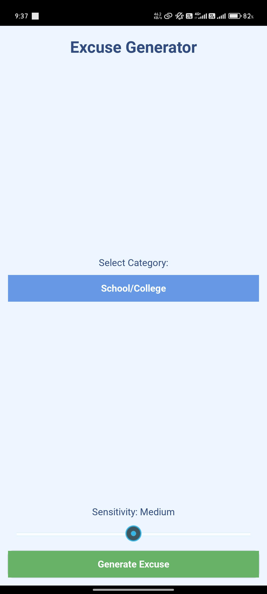
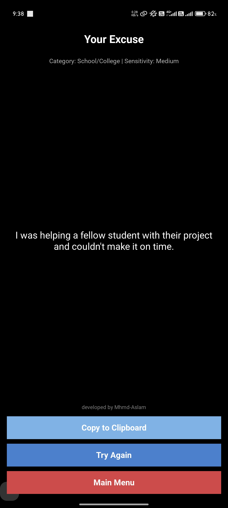
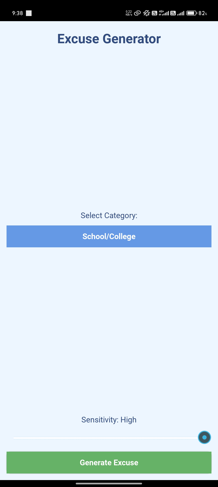

# Excuse Generator App


A cross-platform application that generates context-aware excuses based on selected categories and sensitivity levels. Built with Python and Kivy framework.

---

## 📲 Download APK

👉 [Click here to download the APK](https://github.com/Mhmd-Aslam/Excuse-Generator/raw/main/bin/excuseapp-3.2-arm64.apk)

## 🚀 Features

- 🎓 Three main categories: School/College, Work, Life  
- 🎚️ Adjustable sensitivity levels (Low, Medium, High)  
- 📋 Copy to clipboard functionality  
- 💡 Responsive UI with animations  
- 🌐 Cross-platform compatibility (Android & Windows)    
- 🧩 Customizable excuse database  
- 📱 Adaptive layout for different screen sizes  

---

## 🛠️ Installation

### Prerequisites
- Python 3.7+
- Kivy 2.3.0
- Android Build Tools (for APK generation)

### Clone the Repository
```bash
git clone https://github.com/Mhmd-Aslam/Excuse-Generator.git
cd excuse-generator
```

### Install Requirements
```bash
pip install kivy
```

---

### 📦 For Android
```bash
# Install Buildozer
pip install buildozer

# Build APK
buildozer android debug
```

---

### 💻 For Windows
```bash
python main.py
```

---

## 📋 Usage

1. Select a category from the dropdown  
2. Adjust sensitivity using the slider  
3. Click **Generate Excuse**  

### On the Excuse Screen:
- Click **Copy to Clipboard** to copy the excuse  
- Click **Try Again** to get another excuse  
- Click **Main Menu** to return to the main menu  

---

## ✏️ Customization

To edit or add new excuses, modify the `excuses.json` file like so:

```json
{
  "Life": {
    "Low": ["I forgot my umbrella and it started raining cats and dogs."],
    "Medium": ["I had a family emergency."],
    "High": ["I had to attend a funeral."]
  }
}
```

---

## 🤝 Contributing

We welcome contributions!
Please open an issue or submit a pull request to help improve this app.

---

## 📷 Screenshots

<p align="left">
  
  
  
</p>


## 📄 License

This project is licensed under the MIT License.

---

## 👨‍💻 Credits

- Built with **Kivy**  
- JSON structure inspired by common excuse patterns
